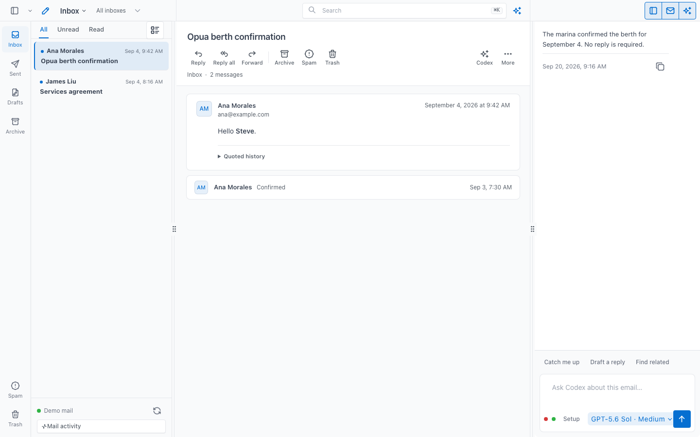

# Dispatch

Dispatch is a native macOS Gmail workbench with messages, rendered mail, and
Codex in one window.



## Download for Apple Silicon

Download the latest signed DMG from
[GitHub Releases](https://github.com/6th-Element-Labs/dispatch-public/releases/latest).

Requirements: Apple Silicon, macOS 14 or later, and an installed Codex CLI or
current ChatGPT desktop app.

## First run

1. Install Codex from <https://developers.openai.com/codex/cli>.
2. Sign in with `codex login`, or sign in in ChatGPT desktop.
3. Open `codex://plugins/gmail@openai-curated`, or use `/plugins` in Codex, and
   connect Gmail.

Dispatch has no telemetry. Gmail credentials remain with Codex. Dispatch stores
indexed mail under `~/Library/Application Support/Dispatch`, attachments under
`~/Library/Caches/Dispatch`, and logs under `~/Library/Logs/Dispatch`.

Sending, deleting, recipient changes, and bulk actions require explicit
approval. Email content is untrusted and cannot grant authority to Dispatch or
Codex.

## Verify a download

Download `SHA256SUMS.txt` beside the DMG, then run:

```bash
shasum -a 256 -c SHA256SUMS.txt
```

## Build from source

Install Node 22, Rust, and the Codex CLI. Then run:

```bash
for dir in services/web services/mail services/agent apps/desktop; do
  npm --prefix "$dir" ci
done
npm --prefix apps/desktop run fetch-node
npm --prefix apps/desktop run build:native
```

## Remove local data

Quit Dispatch, then remove its launch agents, app, and local files:

```bash
launchctl bootout "gui/$(id -u)/com.taikun.dispatch.mail" 2>/dev/null || true
launchctl bootout "gui/$(id -u)/com.taikun.dispatch.agent" 2>/dev/null || true
rm -rf "/Applications/Dispatch.app" \
  "$HOME/Library/Application Support/Dispatch" \
  "$HOME/Library/Caches/Dispatch" \
  "$HOME/Library/Logs/Dispatch"
rm -f "$HOME/Library/LaunchAgents/com.taikun.dispatch.mail.plist" \
  "$HOME/Library/LaunchAgents/com.taikun.dispatch.agent.plist"
```

## Feedback

Public issues are welcome. Pull requests are not accepted because this
repository contains release snapshots from a separate development history.

Licensed under Apache License 2.0.
